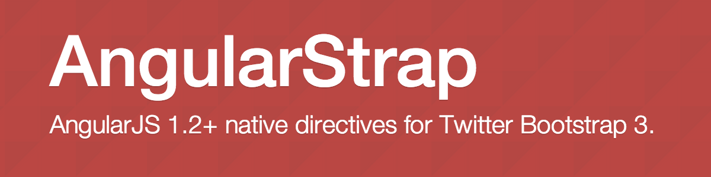

# [AngularStrap](http://mgcrea.github.io/angular-strap)

[](http://mgcrea.github.io/angular-strap)

AngularStrap is a set of native directives that enables seamless integration of [Bootstrap 3.0+](https://github.com/twbs/bootstrap) into your [AngularJS 1.2+](https://github.com/angular/angular.js) app.

- With no external dependency except the [Bootstrap CSS Styles](https://github.com/twbs/bootstrap/blob/master/dist/css/bootstrap.css), AngularStrap is lighter and faster than ever as it does leverage the power of ngAnimate from AngularJS 1.2+!

- AngularStrap is [tested](https://travis-ci.org/mgcrea/angular-strap) against the latest patch release of the 1.2, 1.3, 1.4 and 1.5 branches.

- If you don't want to use `ngAnimate`, you will have to include a tiny [ngAnimate mock](https://github.com/mgcrea/angular-strap/wiki/ngAnimate-mock).


## Documentation and examples

+ Check the [documentation](http://mgcrea.github.io/angular-strap) and [changelog](https://github.com/mgcrea/angular-strap/releases).


## Authors

**Olivier Louvignes**

+ http://olouv.com
+ http://github.com/mgcrea


## Copyright and license

```
The MIT License

Copyright (c) 2012 – 2015 Olivier Louvignes

Permission is hereby granted, free of charge, to any person obtaining a copy
of this software and associated documentation files (the "Software"), to deal
in the Software without restriction, including without limitation the rights
to use, copy, modify, merge, publish, distribute, sublicense, and/or sell
copies of the Software, and to permit persons to whom the Software is
furnished to do so, subject to the following conditions:

The above copyright notice and this permission notice shall be included in
all copies or substantial portions of the Software.

THE SOFTWARE IS PROVIDED "AS IS", WITHOUT WARRANTY OF ANY KIND, EXPRESS OR
IMPLIED, INCLUDING BUT NOT LIMITED TO THE WARRANTIES OF MERCHANTABILITY,
FITNESS FOR A PARTICULAR PURPOSE AND NONINFRINGEMENT. IN NO EVENT SHALL THE
AUTHORS OR COPYRIGHT HOLDERS BE LIABLE FOR ANY CLAIM, DAMAGES OR OTHER
LIABILITY, WHETHER IN AN ACTION OF CONTRACT, TORT OR OTHERWISE, ARISING FROM,
OUT OF OR IN CONNECTION WITH THE SOFTWARE OR THE USE OR OTHER DEALINGS IN
THE SOFTWARE.
```
